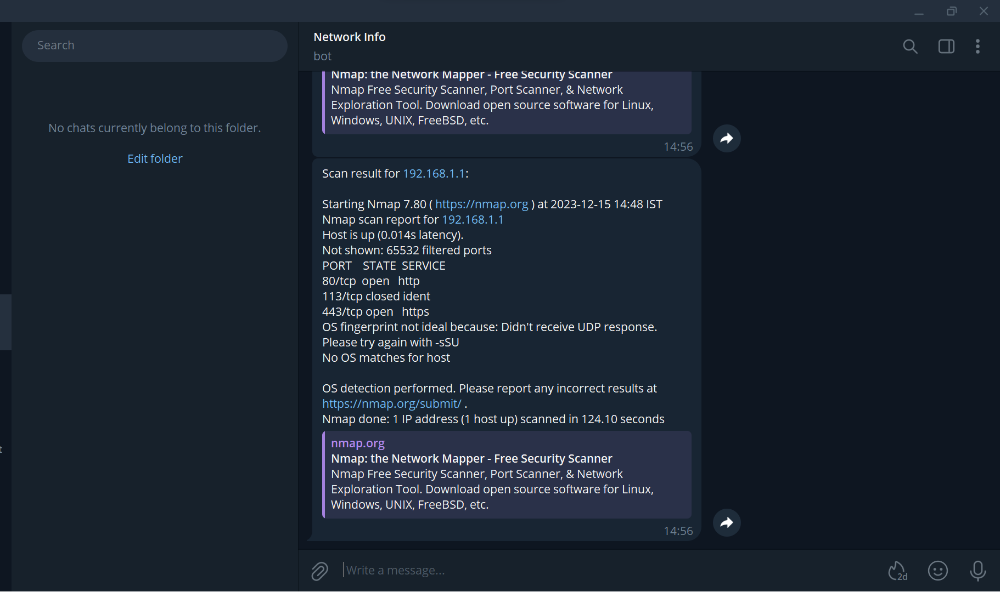

# Node Nmap Scanner

## Overview

Port Scanner is a simple JS script that utilizes the `nmap` tool and telegram package to send the report via telegram  

## Features

- **Port Scanning:** Identify open ports on target machines.
- **Service Version Detection:** Determine the services running on open ports.
- **OS Fingerprinting:** Attempt to identify the operating system of target hosts.

## Prerequisites

- Node.js installed on your machine. You can download it from [nodejs.org](https://nodejs.org/).
- Nmap installed on your machine. You can download it from [nmap.org](https://nmap.org)

## Installation

1. Clone the repository:

    ```bash
    git clone https://github.com/dinakar0745/Ports-Scanner
    ```

2. Navigate to the project directory:

    ```bash
    cd Ports-Scanner
    ```

3. Install dependencies:

    ```bash
    npm install node-telegram-bot-api
    ```

## Usage

1. Edit the `YOUR_TELEGRAM_API_KEY` variable in `index.js` with the API Key of the bot you created

2. Run the script:

    ```bash
    node index.js
    ```

## Example Output

```bash
Scan result for 192.168.1.1:

Starting Nmap 7.80 ( https://nmap.org ) at 2023-12-15 14:48 IST
Nmap scan report for 192.168.1.1
Host is up (0.011s latency).
Not shown: 65532 filtered ports
PORT    STATE  SERVICE
80/tcp  open   http
113/tcp closed ident
443/tcp open   https
OS fingerprint not ideal because: Didn't receive UDP response. Please try again with -sSU
No OS matches for host

OS detection performed. Please report any incorrect results at https://nmap.org/submit/ .
Nmap done: 1 IP address (1 host up) scanned in 109.36 seconds
```


## Contributing

All contributions to Ports-Scanner are welcome.